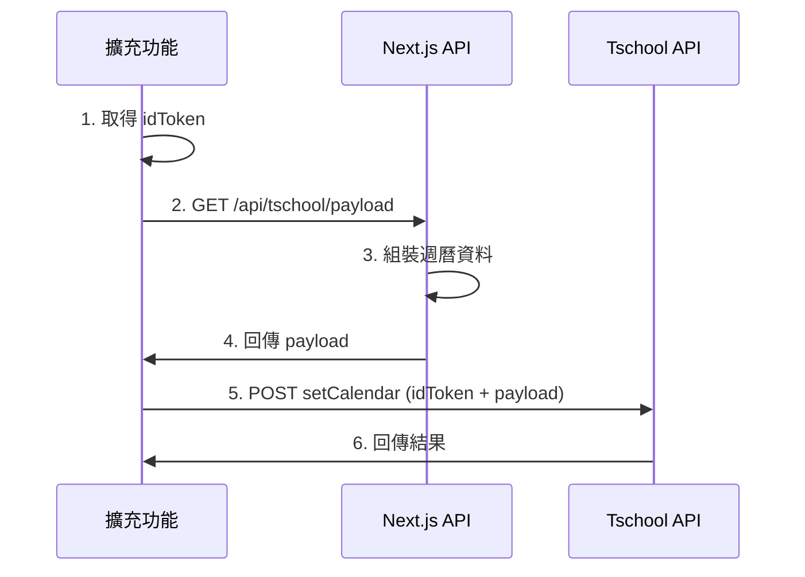

# ClassSync Next.js API 整合指南

這個文檔說明如何將設計好的 Next.js API 整合到你的系統中。

## 🎯 整合目標

將擴充功能從直接組裝 payload 改為從你的 Next.js API 取得組裝好的資料，實現：

- 集中化的資料邏輯管理
- 更靈活的週曆設定
- 更好的錯誤處理
- 便於維護和擴展

## 📁 檔案結構

完成後你將有以下結構：

```
project/
├── extention/                    # 擴充功能
│   ├── background.js            # 已更新，整合新 API
│   ├── manifest.json            # 已更新，新增 host_permissions
│   └── ... (其他擴充功能檔案)
│
└── nextjs-api/                  # Next.js API 專案
    ├── app/api/tschool/payload/
    │   ├── route.ts             # 主要 API 端點
    │   └── types.ts             # 型別定義
    ├── .env.example             # 環境變數範例
    ├── package.json             # 專案設定
    └── README.md                # 使用說明
```

## 🚀 部署步驟

### 1. 部署 Next.js API 到 Zeabur

```bash
# 進入 Next.js 目錄
cd nextjs-api

# 安裝依賴
npm install

# 設定環境變數
cp .env.example .env.local

# 編輯環境變數 - 生成強密鑰
openssl rand -base64 32
# 將結果填入 .env.local 的 TSCHOOL_API_SECRET

# 本機測試
npm run dev

# 部署到 Zeabur
# 1. 在 Zeabur 創建新專案
# 2. 連接 Git 倉庫
# 3. 設定環境變數 TSCHOOL_API_SECRET
# 4. 部署完成後記下域名：cst.zeabur.app
```

### 2. 更新擴充功能設定

在 `background.js` 中更新 API 密鑰：

```javascript
// 將這個密鑰改為與 .env.local 一致的值
const API_SECRET = 'your-actual-secret-key-here';
```

### 3. 測試整合

```bash
# 測試 API 端點
curl -H "Authorization: Bearer your-secret-key" \
     "https://cst.zeabur.app/api/tschool/payload?week=39"

# 應該回傳完整的週曆資料 JSON
```

## ⚙️ 設定選項

### API 密鑰管理

**生產環境建議**：
```javascript
// 在 background.js 中從 chrome.storage 讀取密鑰
async function getApiSecret() {
  const result = await chrome.storage.sync.get(['apiSecret']);
  return result.apiSecret || 'fallback-key';
}
```

### 自訂週曆邏輯

在 `route.ts` 的 `getUserInfo` 函數中設定：

```typescript
// 根據使用者 email 回傳不同的預設行程
if (email?.includes('teacher')) {
  return {
    // 教師版行程
    customSchedule: {
      "2024-09-25": { am: "弘道基地", pm: "弘道基地" }
    }
  };
}

// 學生版行程
return {
  customSchedule: {
    "2024-09-25": { am: "其他地點:圖書館", pm: "吉林基地" }
  }
};
```

## 🔄 資料流程



## 🛠️ 故障排除

### 常見問題

1. **401 Unauthorized**
   - 檢查 API_SECRET 是否一致
   - 確認 Authorization 標頭格式：`Bearer secret`

2. **CORS 錯誤**
   - 確認 manifest.json 有 `https://cst.zeabur.app/*`
   - 檢查 API 的 CORS 設定

3. **404 Not Found**
   - 確認 Next.js 專案已正確部署
   - 檢查域名和路徑是否正確

4. **週次計算錯誤**
   - 調整 `route.ts` 中的學期開始日期
   - 檢查時區設定

### 除錯技巧

1. **檢視擴充功能日誌**：
   ```javascript
   // 在 background.js 中查看 console
   chrome.runtime.onMessage.addListener(console.log);
   ```

2. **檢視 API 日誌**：
   ```bash
   # Zeabur 日誌
   zeabur logs
   ```

3. **手動測試 API**：
   ```bash
   # 直接測試 API 回應
   curl -v -H "Authorization: Bearer your-key" \
        "https://cst.zeabur.app/api/tschool/payload"
   ```

## 📈 後續擴展

### 1. 使用者管理

```typescript
// 在 route.ts 中加入真實的使用者查詢
async function getUserInfo(email?: string): Promise<UserInfo> {
  const user = await db.user.findUnique({
    where: { email },
    include: { scheduleSettings: true }
  });

  return {
    uid: user.id,
    name: user.name,
    email: user.email,
    customSchedule: user.scheduleSettings.weeklySchedule
  };
}
```

### 2. 動態地點管理

```typescript
// 從資料庫讀取可用地點
const availableLocations = await db.location.findMany({
  where: { active: true }
});
```

### 3. 排程管理

```typescript
// 支援多週設定
const weeklySchedules = await db.schedule.findMany({
  where: {
    userId: user.id,
    week: { gte: startWeek, lte: endWeek }
  }
});
```

## ✅ 部署檢查清單

- [ ] Next.js API 已部署到 `cst.zeabur.app`
- [ ] 環境變數 `TSCHOOL_API_SECRET` 已設定
- [ ] API 端點可正常存取並回傳正確格式
- [ ] 擴充功能的 `API_SECRET` 已更新
- [ ] `manifest.json` 包含正確的 host_permissions
- [ ] 測試完整的填報流程
- [ ] 錯誤處理機制正常運作
- [ ] 日誌輸出符合預期

完成以上步驟後，你的 ClassSync 系統就成功整合了集中化的 API 架構！